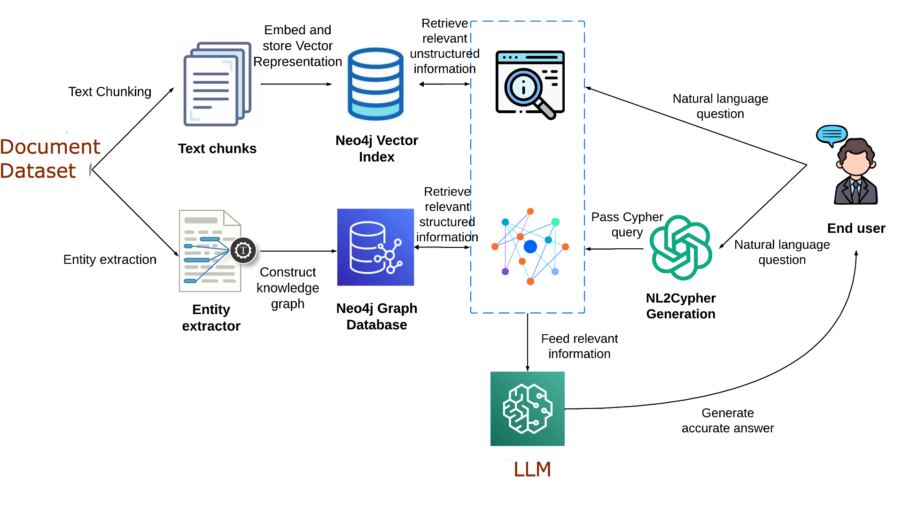
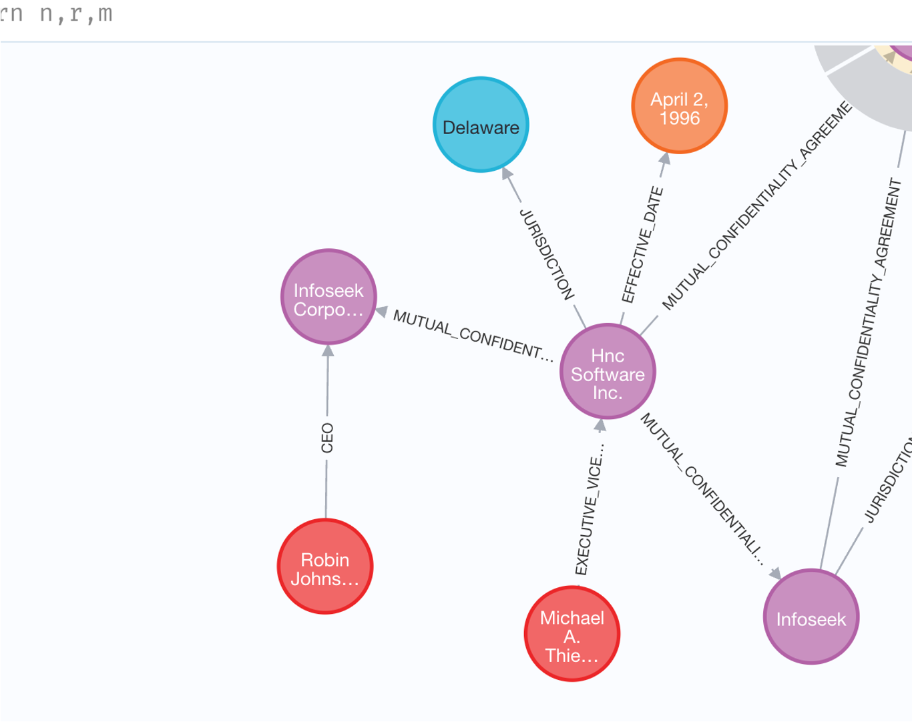

### 10

```
input
files
```
/home/sridhanya_ganapathi_team_neustar/sridhanya/neo4j/demo/data/raw : 10 Input Files




# knowledge graph

# constructed

# using a single

# chunk of a

# document


# Disadvantages

## • Semistructured data is well suited eg (“Effective Date) tag in our


## • or obvious NER Tags (person, location etc)

## • or we have give shots for the NER tags

## • How to handle Entity Disambiguation and multi hop questions

## • And query generated


tools = [
Tool(
name="Query",
func=query_db,
description="Use this tool to find entities in the user prompt that can be used to generate queries"
),
Tool(
name="Similarity Search",
func=similarity_search,
description="Use this tool to perform a similarity search with the products in the database"
)
]

tool_names = [f"{tool.name}: {tool.description}" for tool in tools]


prompt_template = '''Your goal is to find a product in the database that best matches the user prompt.
You have access to these tools:

{tools}

Use the following format:

Question: the input prompt from the user
Thought: you should always think about what to do
Action: the action to take (refer to the rules below)
Action Input: the input to the action
Observation: the result of the action
... (this Thought/Action/Action Input/Observation can repeat N times)
Thought: I now know the final answer
Final Answer: the final answer to the original input question

Rules to follow:

1. Start by using the Query tool with the prompt as parameter. If you found results, stop here.
2. If the result is an empty array, use the similarity search tool with the full initial user prompt. If you found results, stop here.
3. If you cannot still cannot find the answer with this, probe the user to provide more context on the type of product they are looking for.

Keep in mind that we can use entities of the following types to search for products:

{entity_types}.

3. Repeat Step 1 and 2. If you found results, stop here.
4. If you cannot find the final answer, say that you cannot help with the question.

Never return results if you did not find any results in the array returned by the query tool or the similarity search tool.

If you didn't find any result, reply: "Sorry, I didn't find any suitable products."

If you found results from the database, this is your final answer, reply to the user by announcing the number of results and returning results in this format (each new result should be on a new line):

name_of_the_product (id_of_the_product)"

Only use exact names and ids of the products returned as results when providing your final answer.

User prompt:
{input}

{agent_scratchpad}
